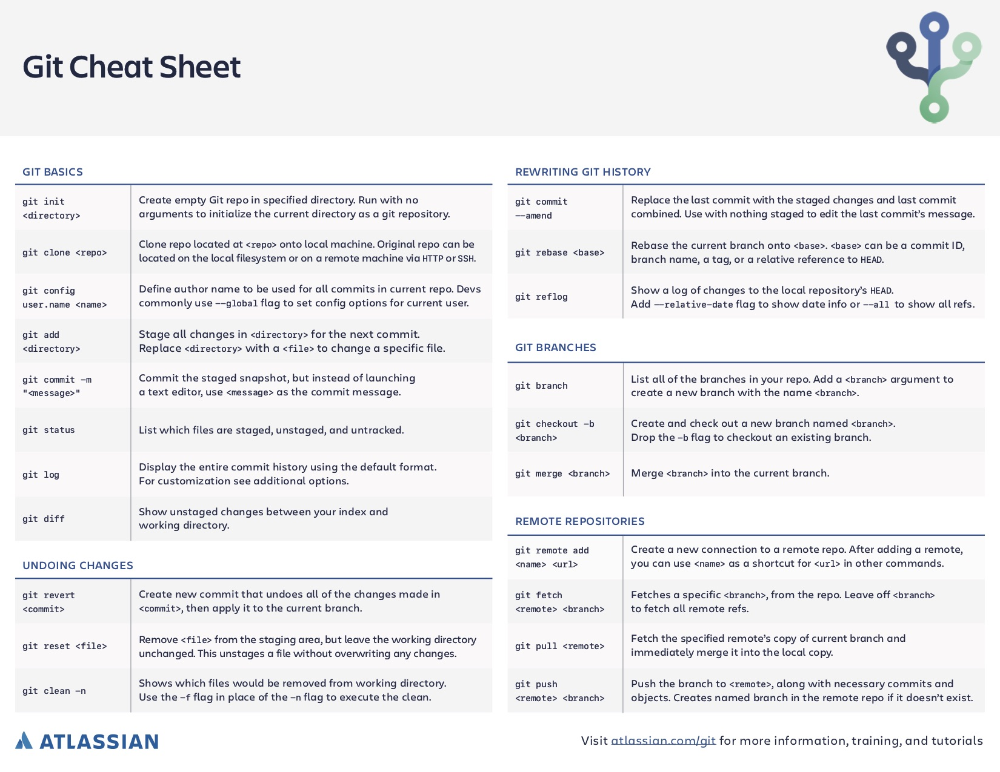

# Lab 2

This lab is an extention of lab 1, where we had to use the command line for a majority of
the steps. I learned how to use the command line to access controls on git such as respotories,
initialization, status, and etc. I was able to memorize most of the git command during this lab, 
and benefited me throughout the course.

### Skills Used in Project
- Creating a new repository on git
- Initializing Javascript files
- Adding files to git in order to track changes
- Understanding which of the three categories the git repository fell into:
    - Untracked
    - Tracked
    - Ignore
    - 

- Creating a .gitignore file to intentionally untrack certain files
